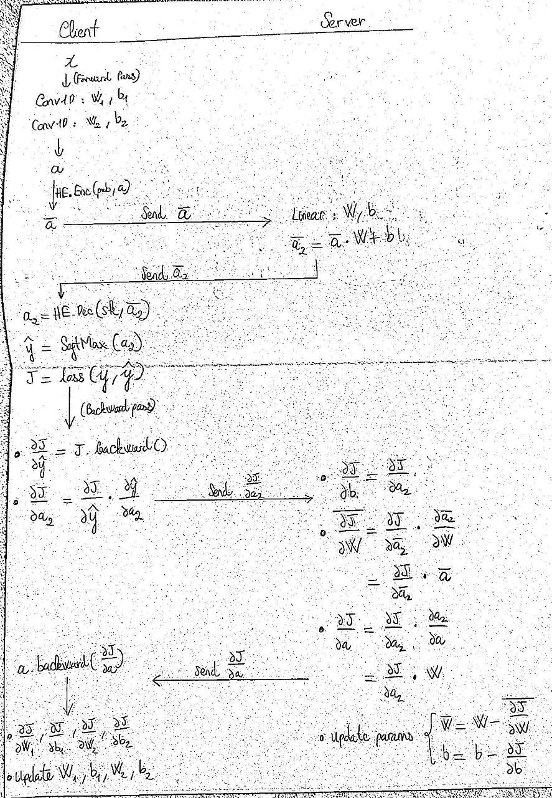
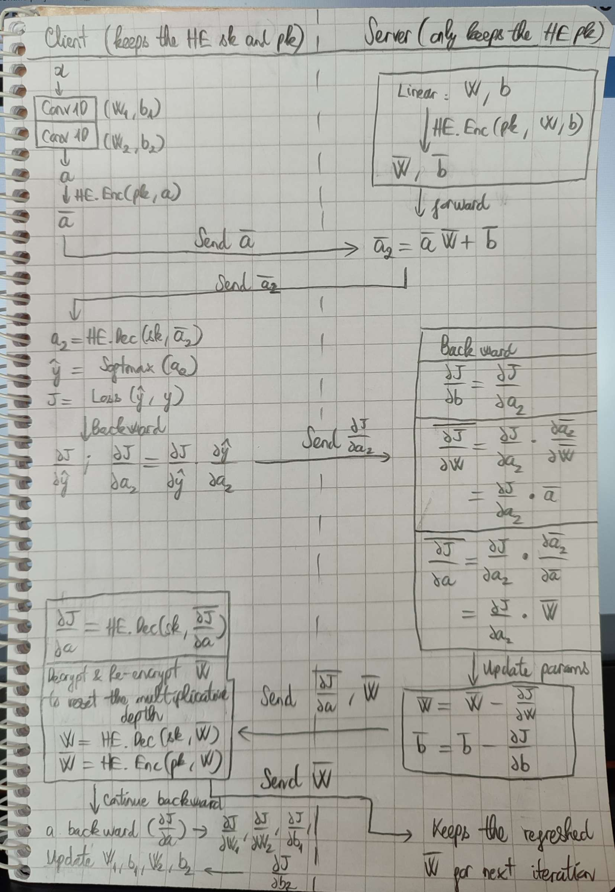

# split-learning-1D-HE-2

## Requirements
`tenseal==0.3.10`  
`pytorch==1.10.0+cu102`  
`icecream==2.1.2`  
`h5py==3.7.0`  

## Improved protocols for split-learning-1D-HE

### Improved protocol 1

The client stops calculating and sending ∂J/∂w(L) to the server. Now, the server will have to calculate ∂J/∂w(L) himself in the encrypted form, making the server’s weights become encrypted after being updated. This solution may have two disadvantages: it increases dramatically the required amount of computation, and can make the computation circuits of HE run out of depth => got the error `encrypted1 and encrypted2 parameters mismatched`)

### Improved protocol 2

