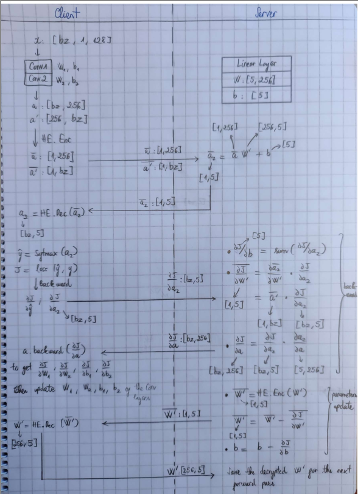

# HESplit
Privacy-preserving neural network training using split learning and homomorphic encryption (CKKS scheme).

## Requirements
`tenseal==0.3.10`  
`pytorch==1.10.0+cu102`  
`icecream==2.1.2`  
`h5py==3.7.0`  

## Protocol Explanation

## Code
### Structure

### Running